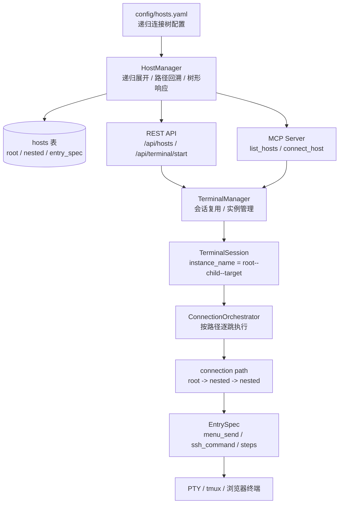
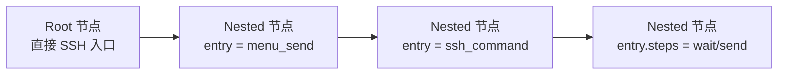
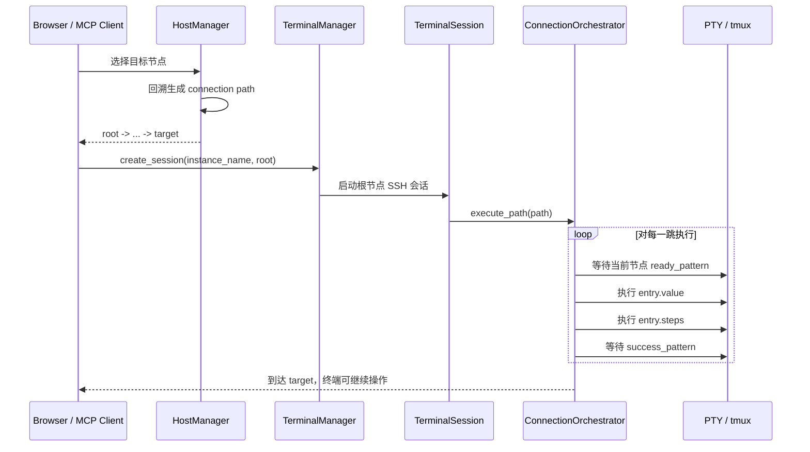

# 多跳 SSH 重构记录

## 需求摘要
- 将当前仅支持“堡垒机 + 二级子机”的模型，重构为支持任意深度多跳 SSH 的通用连接树。
- 本次重构不要求兼容旧配置结构，直接切换到新模型。
- 目标是支持类似“堡垒机 -> 子机 -> 再执行 ssh 到下一跳主机”的链式连接场景。

## 重构后架构图

### 1. 静态架构图

### 2. 配置与对象模型图

- `root` 节点保存真实 SSH 入口信息：`hostname`、`port`、`username`、`auth_type`。
- `nested` 节点不再维护独立 SSH 入口，而是通过 `entry` 描述“如何从父节点进入当前节点”。
- `entry` 是统一的入口动作 DSL，当前支持：
  - `menu_send`
  - `ssh_command`
  - `steps(wait/send/timeout)`

## 运行时链路图

## 当前进展
- [x] 完成配置模型与数据模型重构，切换为 `root / nested + entry` 递归节点树。
- [x] 完成连接编排器重构，支持按 `root -> ... -> target` 路径逐跳进入。
- [x] 完成 MCP / REST / 前端主机树接口重构，统一按递归结构和 `instance_name` 工作。
- [x] 完成多跳核心测试与编译验证。

## 本轮实施内容
- 将主机配置模型从旧的两段式跳板结构改为递归树结构。
- 将入口动作统一抽象为 `EntrySpec`，支持 `menu_send`、`ssh_command` 和附加 `steps`。
- 将终端实例名统一为按路径拼接的 `instance_name`，例如 `root--child--target`。
- 调整 `HostManager`，支持 YAML 递归展开、路径回溯、树形响应输出。
- 调整 `ConnectionOrchestrator`，支持多跳路径执行和入口动作编排。
- 调整 `src/api/hosts.py` 与 `src/mcp_server/server.py`，使 REST / MCP 接口按新模型工作。
- 补充 `one-key` 密码方案文档：明确根节点使用 `password`、多跳节点使用 `entry_password`，并用 YAML anchor 复用 `password_step` / `manual_mfa_step`。
- 更新 `config/hosts-example.yaml`，将配置模板切换为当前递归树模型，不再保留旧版 `bastion + jump_hosts` 示例。

## 验证结果
- 使用项目内 `.venv` 虚拟环境验证，Python 版本为 `3.13.7`。
- 执行 `./.venv/bin/python -m pytest tests/test_database_migrations.py tests/test_host_manager.py tests/test_jump_orchestrator.py -q`，结果为 `18 passed`。
- 执行 `./.venv/bin/python -m compileall src tests`，语法编译通过。

## 未完成任务
- 无阻塞性的未完成实施任务。
- 如需进一步增强，可补充更多真实配置样例和端到端联调验证。

## 遗留问题
- `HostManager.sync_from_yaml` 与数据库迁移测试中仍有少量 basedpyright warning，主要集中在 `yaml.safe_load` 和 SQLAlchemy 原生结果类型推导，不影响运行与测试通过。
- 当前启动策略假设 `hosts.yaml` 是 `hosts` 表的可重建来源；如果后续引入只存于数据库、不回写 YAML 的主机数据，需要为其补充独立迁移方案。
- 如后续需要更复杂的多因子认证 / 特殊交互，可继续扩展 `EntrySpec.steps` 的 DSL 能力。
